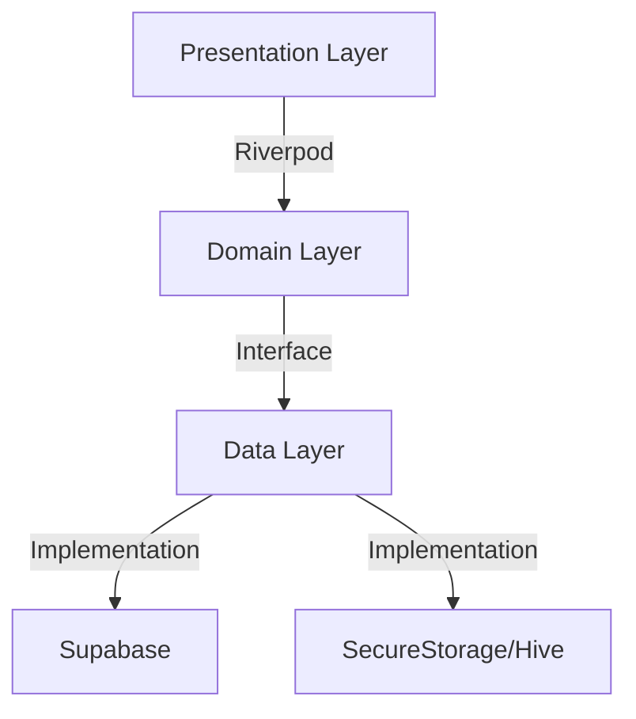

# 🌉 Project Context: Bridge (Level 2)

## 📝 Project Overview
**Bridge**는 이웃 간에 재능과 시간을 교환하는 **Time Bank (시간 화폐) & Skill Share (재능 공유)** 플랫폼입니다.
"돈"이 아닌 "시간"을 화폐로 사용하여, 서로 돕고 연결되는 따뜻한 커뮤니티를 지향합니다.

## 🎯 Learning Objectives (Level 2)
Level 1(`habit_flow`)에서 다룬 기초 위에 다음을 더합니다:
1.  **Supabase Deep Dive**: 단순 CRUD를 넘어 **Realtime**, **Relational Queries**, **Edge Functions**, **RLS (Security Hierarchy)**를 마스터합니다.
2.  **Advanced State Management**: 단순 데이터 흐름이 아닌, **상태 머신(State Machine)** 기반의 로직(예: 거래 상태: 요청 -> 수락 -> 진행 -> 완료 -> 취소)을 다룹니다.
3.  **TDD & Testing**: UI 테스트(Widget Test)와 통합 테스트(Integration Test)를 **구현 전**에 작성하는 습관을 기릅니다.
4.  **Complex UI**: 채팅(Chat), 지도(Map - Optional), 캘린더 등 난이도 높은 UI 패턴을 구현합니다.

## 🛠 Tech Stack
| Category | Technology | Usage |
| :--- | :--- | :--- |
| **Framework** | Flutter | Cross-platform implementation |
| **Language** | Dart | 100% Null Safety |
| **State** | **Riverpod (Notifier)** | Immutable State Management |
| **Router** | **GoRouter** | Deep linking & Type-safe routes |
| **Backend** | **Supabase** | Auth, PostgresDB, Realtime, Storage |
| **Architecture** | **Clean Architecture** | Presentation / Domain / Data layers |
| **Styling** | **Design System** | Custom Theme, Google Fonts, Tailwind-inspired colors |

## 🏗 System Architecture (Clean Architecture)



### 1. Presentation Layer (UI)
*   **Widgets**: 순수 UI 컴포넌트. 로직을 포함하지 않음.
*   **ViewModels (Notifiers)**: UI 상태 관리 및 사용자 입력 처리.

### 2. Domain Layer (Business Logic)
*   **Entities**: 순수 Dart 객체 (Immutable). `freezed` 사용 권장.
*   **UseCases**: 비즈니스 로직 단위 (예: `RequestHelp`, `AcceptOffer`).
*   **Repositories (Interface)**: 데이터 접근을 위한 추상 인터페이스.

### 3. Data Layer (Data Access)
*   **Repositories (Impl)**: 인터페이스 구현체. API 호출 및 로컬 저장소 관리.
*   **Data Sources**: Supabase Client, Local Storage 직접 접근.
*   **DTO (Data Transfer Objects)**: JSON 직렬화/역직렬화 담당 (`code_generation` 비권장, 수동 매핑 지향).

## 🗂 Folder Structure
```
lib/
├── app/                 # App-wide configurations (Theme, Routes, Constants)
├── core/                # Shared utilities & extensions (Error handling, UseCase interface)
├── features/            # Feature-based modules
│   ├── auth/            # Authentication feature
│   ├── feed/            # Request/Offer Feed
│   ├── chat/            # Realtime Chat
│   ├── profile/         # User Profile & Reputation
│   └── transaction/     # Exchange Logic
└── main.dart            # Entry point
```

## 📜 Key Conventions
1.  **Strict Linting**: `flutter_lints`보다 엄격한 룰 적용.
2.  **No Magic Strings**: 모든 문자열, 색상, 스타일은 상수로 관리.
3.  **Offline First**: 네트워크가 끊겨도 앱이 멈추지 않아야 함 (Optimistic UI는 선택적 적용).
4.  **Controller Pattern**:
    *   UI 로직은 `ConsumerWidget`이 아닌 **Controller (AsyncNotifier)** 위임합니다.
    *   `isLoading`, `error` 상태 관리를 `AsyncValue`로 통일하여 안전하게 처리합니다.
